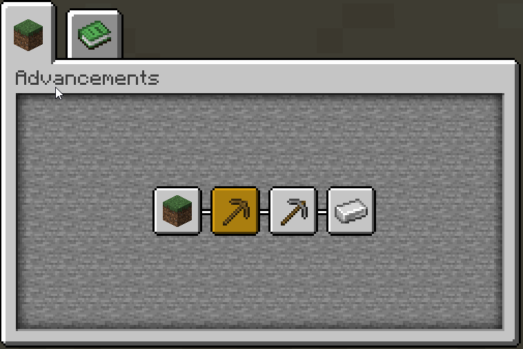

# generator-beet
[![NPM version][npm-image]][npm-url] [![Dependency Status][daviddm-image]][daviddm-url]

> Yeoman generator for creating [Beet](https://github.com/mcbeet/beet) projects

## Table of Contents
- [Features](#Features)
    - [Datapack boilerplate](#Datapack-boilerplate)
    - [Datapack Advancement](#Datapack-Advancement)
    - Resourcepack boilerplate
    - Build releases using Github Actions
    - Generated Changelog
- [Getting started](#Getting-started)
- [Available commands](#Available-commands)

## Features
### Datapack boilerplate
```bash
datapack
└╴data
  ├╴minecraft
  │ └╴tags
  │   └╴functions
  │     ├╴load.json # Registers 'load' function
  │     └╴tick.json # Registers 'tick' function
  └╴<authorNamspace>
    └╴functions
      └╴<projectNamespace>
        ├╴tick.mcfunction # Called once every tick
        └╴load.mcfunction # Called after datapack is (re)loaded
```
To prevent naming conflicts between datapacks, all your functions, advancements, etc are located in the unique namespace `<authorNamespace>:<projectNamespace>`.<br>
E.g. if the author is `Oran9eUtan` and the project name is `Teleporter`, the `load` function can be called like this: `function oran9eutan:teleporter/load`

## Datapack Advancement
Datapack advancements give users an easy way to see all installed datapacks and their authors.



```bash
datapack
└╴data
  ├╴global
  │ └╴advancements
  │   ├╴root.json              # 1. Root advancement
  │   └╴<authorNamespace>.json # 2. Author advancement
  └╴<authorNamspace>
    └╴advancements
      └╴<projectNamespace>
          └╴installed.json     # 3. Datapack advancement
```
[More Information](https://mc-datapacks.github.io/en/conventions/datapack_advancement.html)

## Getting started

Install [Yeoman](http://yeoman.io) and generator-beet using [npm](https://www.npmjs.com/) (assuming you have pre-installed [node.js](https://nodejs.org/))

```bash
npm install -g yo
npm install -g generator-beet
```

If you want to create a Python project inside your beet project (<b>recommended</b>) you will need [Poetry](https://python-poetry.org/docs/#installation):<br>
([Poetry installation instructions](https://python-poetry.org/docs/#installation))
```bash
# osx / linux
curl -sSL https://raw.githubusercontent.com/python-poetry/poetry/master/get-poetry.py | python -

# windows powershell
(Invoke-WebRequest -Uri https://raw.githubusercontent.com/python-poetry/poetry/master/get-poetry.py -UseBasicParsing).Content | python -
```


Finally, generate your new project:

```bash
yo beet
```

## Available commands
```bash
# Generate new beet project
yo beet [project-name]
    --datapack       # Generate datapack
    --resourcepack   # Generate resourcepack
    --license        # Include a license
    --git            # Initialize git repository
    --python         # Create a Python project

# Only generate datapack
yo beet:datapack

# Only generate resourcepack
yo beet:resourcepack
```

## License

MIT © [Oran9eUtan](https://github.com/OrangeUtan)


[npm-image]: https://badge.fury.io/js/generator-beet.svg
[npm-url]: https://npmjs.org/package/generator-beet
[daviddm-image]: https://david-dm.org/OrangeUtan/generator-beet.svg?theme=shields.io
[daviddm-url]: https://david-dm.org/OrangeUtan/generator-beet
